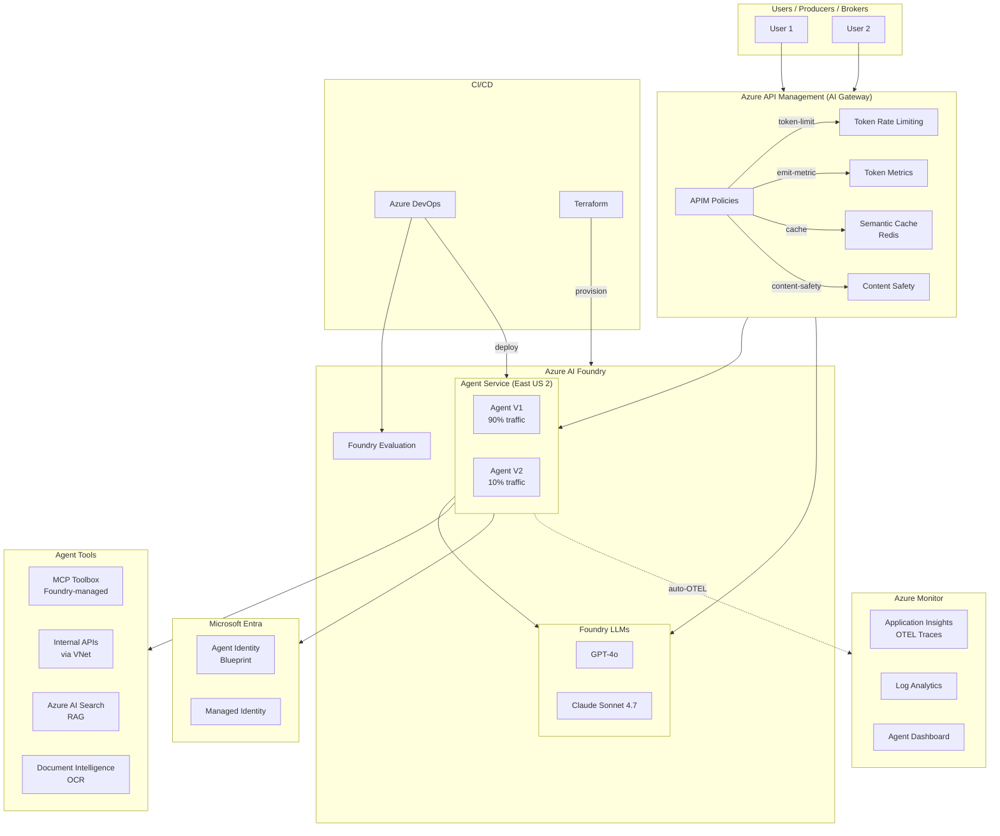
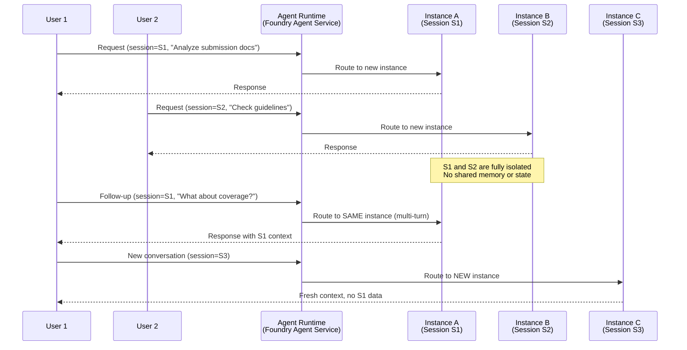
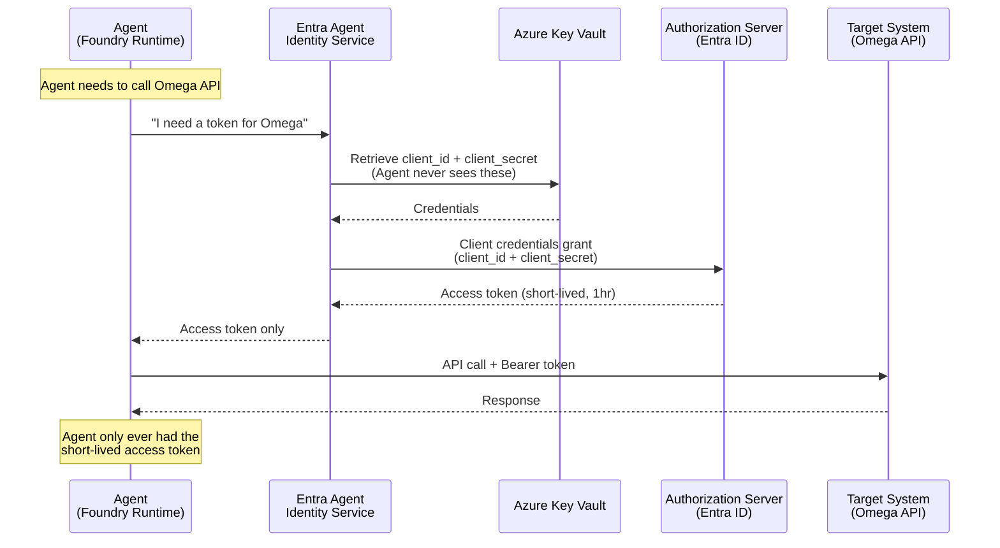
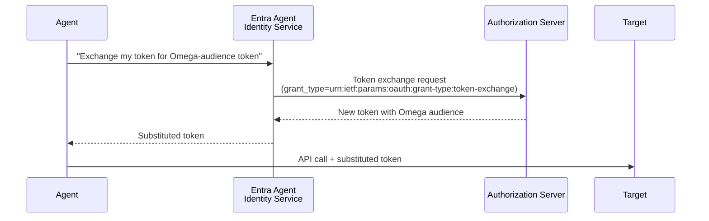
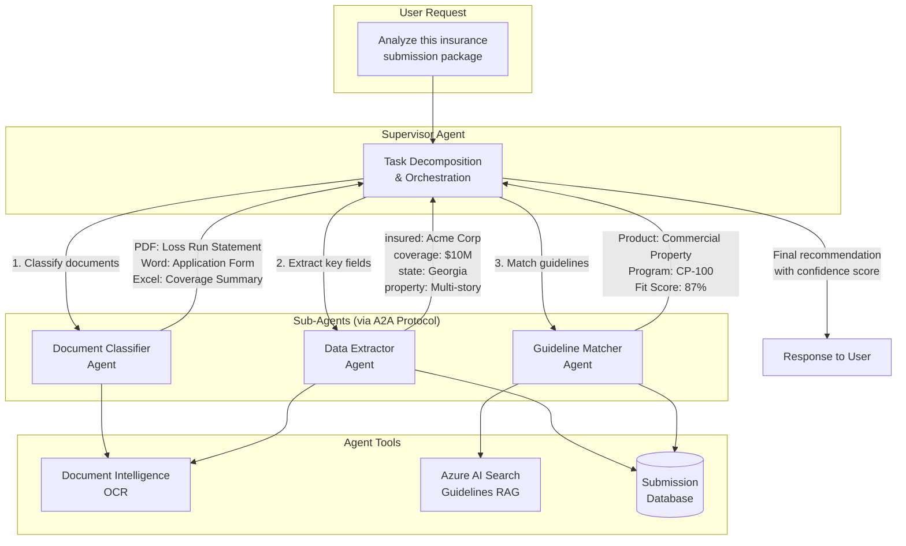
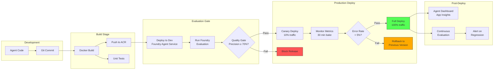
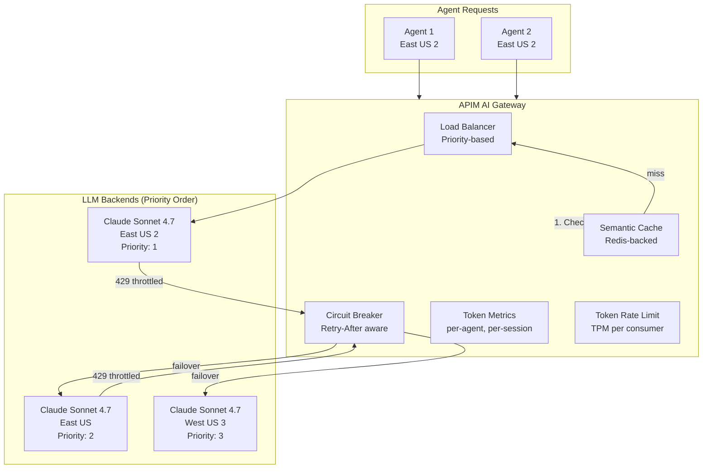
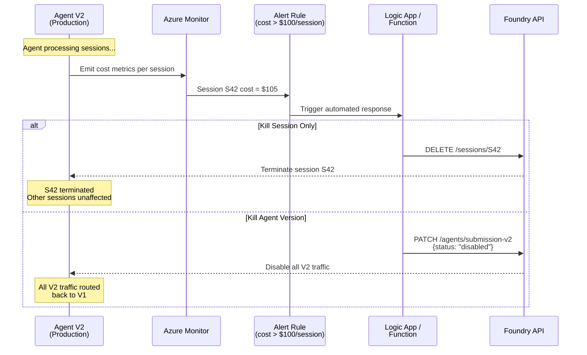

# Architecture Overview

Visual architecture diagrams for all agent patterns. All diagrams use Mermaid and render in GitHub/VS Code.

## 1. Overall Architecture

## 2. Session-Level Isolation

This diagram matches the whiteboard discussion from the design session. Each user session gets its own isolated agent instance — no data leakage between sessions.

### Key Properties
- **VM-per-session**: Each session gets a dedicated micro-VM (not a shared container)
- **Multi-turn continuity**: Subsequent calls with the same session ID route to the same instance
- **30-day persistence**: Sessions persist up to 30 days with 15-min idle timeout
- **Auto state restore**: If an instance is recycled, state is restored transparently
- **No data leakage**: Producer team A's session cannot access Broker team B's session data

## 3. Agent Identity Flow

The agent never touches long-lived credentials (client secrets). Instead, the identity service handles token acquisition.

### Token Exchange Flow (Optional)

## 4. Multi-Agent Supervisor Pattern

Hierarchical agent design: a supervisor decomposes tasks and delegates to specialized sub-agents.

### Orchestration Details
- Supervisor uses **LLM reasoning** to decompose (not a hardcoded workflow)
- Sub-agents can be called **in parallel** when independent (classify + extract)
- Sub-agents can be called **sequentially** when dependent (extract → match)
- Supervisor **validates** sub-agent outputs and may retry or escalate
- All communication via **A2A protocol** (Agent Framework native)

## 5. CI/CD Pipeline Flow

## 6. LLM Gateway (APIM) Architecture

Answers: "Is there a global endpoint that routes to any Claude Sonnet 4.7 in US?"

### How It Works
1. Agent sends LLM request to APIM gateway (single endpoint)
2. APIM checks **semantic cache** — if similar prompt was seen, return cached response (60-80% cost savings)
3. On cache miss, route to **primary backend** (East US 2, lowest latency)
4. If primary returns **429 (throttled)**, circuit breaker triggers **automatic failover** to next priority
5. **Token metrics** emitted per agent, per session, per consumer for cost attribution
6. **Token rate limiting** enforced per subscription to prevent runaway costs

## 7. Kill Switch Architecture

